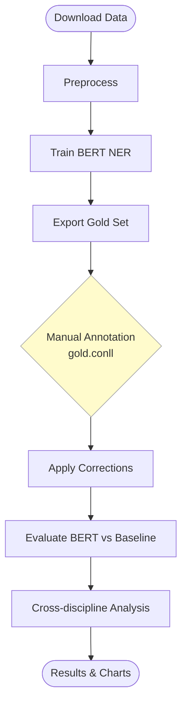

# SkillPostBERT

Fine-tuning BERT for skill extraction from engineering job postings, with a
cross-discipline comparison of skill demand across **mechanical**, **electrical**,
and **software** engineering.

NLP Applications course project (ECE/SSE/CYS 691).

---

## What it does

1. **Extracts** skill mentions from raw job-posting text using a BERT model fine-tuned for Named Entity Recognition (NER).
2. **Classifies** each skill into a taxonomy: Technical, Tools, Soft Skills, Certifications.
3. **Compares** skill demand across the three engineering disciplines and visualizes the differences.
4. **Baseline:** a rule-based keyword matcher, included to demonstrate the value added by the learned model. Both are scored on Precision / Recall / F1 per category.

---

## Quick reference

Steps 1–5 are one-time setup. Steps 6–8 are the pipeline.

> **Shortcut:** `setup_env` automates steps 1–4 in one command — see [Setup](#setup) below.

### Mac / Linux / Git Bash

| Step | Command | Description |
|:---:|---|---|
| 1 | `conda create -n SSE691NLP python=3.10` | Create project environment |
| 2 | `conda activate SSE691NLP` | Activate environment |
| 3 | `pip install -r requirements.txt` | Install all dependencies |
| 4 *(GPU)* | `pip install torch … --index-url …/cu128` | Swap in CUDA PyTorch — [see GPU setup](#3--gpu--cuda-setup-nvidia-only) |
| 5 | copy `~/.kaggle/kaggle.json` | Place Kaggle credentials — [see Kaggle setup](#4--place-your-kaggle-credentials) |
| 6 | `./scripts/run_part1.sh` | Download → preprocess → train BERT → export gold set |
| 7 | edit `data/processed/gold.conll` | **Manual:** hand-correct BIO tags in the gold file |
| 8 | `./scripts/run_part2.sh` | Apply corrections → evaluate → generate charts |

**Utilities**

| Script | Description |
|---|---|
| `./scripts/setup_env.sh` | Automate steps 1–4: create env, install deps, detect GPU |
| `./scripts/check_env.sh` | Verify environment is ready before running |
| `./scripts/clear_env.sh` | Remove the conda environment entirely (rebuild with `setup_env`) |
| `./scripts/clear_cache.sh` | Delete raw data (re-fetched on next run) |
| `./scripts/clear_training.sh` | Delete model checkpoints (retrain without re-downloading) |
| `./scripts/reset.sh` | Full reset — wipe all artifacts and remove the conda environment |

### Windows (PowerShell)

| Step | Command | Description |
|:---:|---|---|
| 1 | `conda create -n SSE691NLP python=3.10` | Create project environment |
| 2 | `conda activate SSE691NLP` | Activate environment |
| 3 | `pip install -r requirements.txt` | Install all dependencies |
| 4 *(GPU)* | `pip install torch … --index-url …/cu128` | Swap in CUDA PyTorch — [see GPU setup](#3--gpu--cuda-setup-nvidia-only) |
| 5 | copy `~\.kaggle\kaggle.json` | Place Kaggle credentials — [see Kaggle setup](#4--place-your-kaggle-credentials) |
| 6 | `.\scripts\run_part1.ps1` | Download → preprocess → train BERT → export gold set |
| 7 | edit `data\processed\gold.conll` | **Manual:** hand-correct BIO tags in the gold file |
| 8 | `.\scripts\run_part2.ps1` | Apply corrections → evaluate → generate charts |

**Utilities**

| Script | Description |
|---|---|
| `.\scripts\setup_env.ps1` | Automate steps 1–4: create env, install deps, detect GPU |
| `.\scripts\check_env.ps1` | Verify environment is ready before running |
| `.\scripts\clear_env.ps1` | Remove the conda environment entirely (rebuild with `setup_env`) |
| `.\scripts\clear_cache.ps1` | Delete raw data (re-fetched on next run) |
| `.\scripts\clear_training.ps1` | Delete model checkpoints (retrain without re-downloading) |
| `.\scripts\reset.ps1` | Full reset — wipe all downloaded and generated artifacts |

---

## Models & data

**Models**

| | |
|---|---|
| Primary | `bert-base-uncased`, fine-tuned for token classification (NER) |
| Lighter alternative | `distilbert-base-uncased` — viable on CPU, much faster to train |
| Baseline | Dictionary keyword matching (`src/baseline.py`) |

Hardware is detected automatically at runtime: Apple Silicon MPS > NVIDIA CUDA > CPU.
A GPU is strongly recommended for BERT; DistilBERT is tolerable on CPU.

**Data**

- LinkedIn Job Postings Dataset (Kaggle)
- Indeed Job Scrape Dataset (Kaggle)

Place raw CSVs under `data/raw/`. They are gitignored — see `data/raw/README.md`.

---

## Setup

### Prerequisites

- Python 3.10+
- A [Kaggle account](https://www.kaggle.com) with an API token (`kaggle.json`)

---

### Automated setup

`setup_env` handles steps 1–4 in a single command. Run it from your base conda
environment — no prior activation needed.

**Mac / Linux / Git Bash**
```bash
./scripts/setup_env.sh
conda activate SSE691NLP
```

**Windows (PowerShell)**
```powershell
.\scripts\setup_env.ps1
conda activate SSE691NLP
```

Hardware is detected automatically:
- **NVIDIA GPU** — reads the CUDA driver version via `nvidia-smi` and installs the correct wheel (`cu118` / `cu121` / `cu128`).
- **Apple Silicon** — the default PyTorch wheel already includes MPS; nothing extra is installed.
- **CPU only** — the CPU-only wheel from `requirements.txt` is kept.

After activating, run `check_env` to confirm everything is ready:

```bash
./scripts/check_env.sh       # Mac / Linux
.\scripts\check_env.ps1      # Windows
```

---

### Manual setup steps

#### 1 — Create and activate the conda environment

```bash
conda create -n SSE691NLP python=3.10
conda activate SSE691NLP
```

<details>
<summary>Using a plain virtualenv instead</summary>

**Mac / Linux**
```bash
python -m venv .venv
source .venv/bin/activate
```

**Windows (PowerShell)**
```powershell
python -m venv .venv
.venv\Scripts\Activate.ps1
```
</details>

#### 2 — Install dependencies

```bash
pip install -r requirements.txt
```

#### 3 — GPU / CUDA setup (NVIDIA only)

`requirements.txt` resolves to a **CPU-only** PyTorch build on most platforms.
If you have an NVIDIA GPU, replace it with the CUDA-enabled wheel after step 2.

| GPU generation | Architecture | Recommended wheel |
|---|---|:---:|
| RTX 50xx (5070, 5080, 5090 …) | Blackwell | `cu128` |
| RTX 40xx (4070, 4080, 4090 …) | Ada Lovelace | `cu128` |
| RTX 30xx (3070, 3080, 3090 …) | Ampere | `cu121` or `cu128` |
| RTX 20xx / GTX 16xx | Turing | `cu118` |

**Blackwell / Ada — CUDA 12.8**
```bash
pip install torch torchvision torchaudio --index-url https://download.pytorch.org/whl/cu128
```

**Ampere — CUDA 12.1**
```bash
pip install torch torchvision torchaudio --index-url https://download.pytorch.org/whl/cu121
```

Verify the install found your GPU:
```bash
python -c "import torch; print(torch.cuda.is_available(), torch.cuda.get_device_name(0))"
# expected: True  NVIDIA GeForce RTX 5070  (or your card)
```

> **Note:** Your driver must support the CUDA version you choose. Run `nvidia-smi`
> and check the *CUDA Version* in the top-right corner.

#### 4 — Place your Kaggle credentials

Download `kaggle.json` from [kaggle.com/settings](https://www.kaggle.com/settings) → *API → Create New Token*,
or generate it interactively:

**Mac / Linux**
```bash
read -p "Kaggle username: " KAGGLE_USER
read -s -p "Kaggle API key:  " KAGGLE_KEY && echo
mkdir -p ~/.kaggle
echo "{\"username\":\"$KAGGLE_USER\",\"key\":\"$KAGGLE_KEY\"}" > ~/.kaggle/kaggle.json
chmod 600 ~/.kaggle/kaggle.json
```

**Windows (PowerShell)**
```powershell
$user = Read-Host "Kaggle username"
$key  = Read-Host "Kaggle API key"
New-Item -ItemType Directory -Force "$env:USERPROFILE\.kaggle" | Out-Null
"{`"username`":`"$user`",`"key`":`"$key`"}" |
    Set-Content "$env:USERPROFILE\.kaggle\kaggle.json" -Encoding utf8
```

**Windows (Command Prompt)**
```cmd
set /p KAGGLE_USER=Kaggle username: 
set /p KAGGLE_KEY=Kaggle API key: 
mkdir "%USERPROFILE%\.kaggle" 2>nul
echo {"username":"%KAGGLE_USER%","key":"%KAGGLE_KEY%"} > "%USERPROFILE%\.kaggle\kaggle.json"
```

---

## Pipeline

The pipeline has a manual annotation checkpoint in the middle. You hand-correct a
small gold set so the BERT-vs-baseline evaluation is honest rather than circular.



### Run the pipeline

**Mac / Linux / Git Bash**
```bash
./scripts/run_part1.sh
# hand-correct data/processed/gold.conll in any text editor
./scripts/run_part2.sh
```

**Windows (PowerShell)**
```powershell
.\scripts\run_part1.ps1
# hand-correct data\processed\gold.conll in any text editor
.\scripts\run_part2.ps1
```

### Override model or output directory

**Mac / Linux / Git Bash**
```bash
MODEL_NAME=distilbert-base-uncased MODEL_DIR=models/distilbert-skills-ner ./scripts/run_part1.sh
```

**Windows (PowerShell)**
```powershell
$env:MODEL_NAME = "distilbert-base-uncased"
$env:MODEL_DIR  = "models/distilbert-skills-ner"
.\scripts\run_part1.ps1
```

---

## Step-by-step reference

Run each stage individually with `python -m`. All commands work identically on
Windows, Mac, and Linux when run from the repo root with your environment active.

### 1. Download data

```bash
python -m src.download_data
```

Fetches the LinkedIn job postings dataset from Kaggle into `data/raw/`.
Requires `kaggle.json` (see [Kaggle setup](#4--place-your-kaggle-credentials)).

### 2. Preprocess

```bash
# cap at 2 000 postings per discipline (fast)
python -m src.preprocess --max 2000

# single file
python -m src.preprocess --input data/raw/myfile.csv

# full corpus (slower)
python -m src.preprocess
```

Cleans text, infers discipline (ME / EE / SE), tokenizes with the BERT fast tokenizer,
and weak-labels BIO tags via the keyword matcher.
Output: `data/processed/corpus.jsonl`.

### 3. Train

```bash
# default config (configs/bert_base.yaml)
python -m src.train

# lighter model — viable on CPU
python -m src.train --model distilbert-base-uncased \
                    --output-dir models/distilbert-skills-ner

# override hyperparameters
python -m src.train --epochs 5 --learning-rate 3e-5
```

Hardware is detected automatically. On CPU, DistilBERT is recommended; BERT-base can take several hours.

### 4. Export a gold evaluation set

```bash
python -m src.evaluate --export-gold --n 60   # ≈ 20 samples per discipline
```

Produces two files:
- `data/processed/gold.conll` — **edit this** to fix the BIO tags
- `data/processed/gold.jsonl` — metadata (do not edit)

Each line in `gold.conll` is `token<TAB>tag`. Fix the second column: add missed skills, remove false positives, correct categories or span boundaries.

### 5. Apply corrections and evaluate

```bash
# fold your hand-corrected labels back in
python -m src.evaluate --apply-conll data/processed/gold.conll

# score BERT vs the keyword baseline on the gold set
python -m src.evaluate --gold data/processed/gold.jsonl \
                        --model models/bert-skills-ner
```

Results are printed as a comparison table and saved to `results/comparison.json`.

### 6. Cross-discipline analysis

```bash
# quick pass using weak labels (no trained model needed)
python -m src.compare --source weak

# full analysis using BERT predictions
python -m src.compare --source bert --model models/bert-skills-ner
```

Writes CSV tables and figures to `results/`.

---

## Utility scripts

| Script | What it removes / does |
|---|---|
| `setup_env` | One-shot env setup: create conda env, install deps, detect and install CUDA PyTorch |
| `check_env` | Report Python version, package versions, GPU, Kaggle credentials, and directory state |
| `clear_env` | Remove the conda environment entirely — run `setup_env` afterwards to rebuild |
| `clear_cache` | `data/raw/` — datasets are re-fetched on the next run |
| `clear_training` | `models/` — checkpoints are regenerated on the next train |
| `reset` | Everything above plus `data/processed/` and `results/` |

> `clear_env` and `reset` print a summary and wait 8 seconds before acting so you can Ctrl-C.
> `clear_env` will refuse to run if the target environment is currently active — deactivate first.

**Mac / Linux / Git Bash**
```bash
./scripts/setup_env.sh        # run from base env, before activating
./scripts/check_env.sh        # run after activating
./scripts/clear_env.sh        # run after deactivating (conda deactivate)
./scripts/clear_cache.sh
./scripts/clear_training.sh
./scripts/reset.sh
```

**Windows (PowerShell)**
```powershell
.\scripts\setup_env.ps1       # run from base env, before activating
.\scripts\check_env.ps1       # run after activating
.\scripts\clear_env.ps1       # run after deactivating (conda deactivate)
.\scripts\clear_cache.ps1
.\scripts\clear_training.ps1
.\scripts\reset.ps1
```

---

## Project layout

```
src/
  taxonomy.py       skill dictionary + BIO label scheme
  baseline.py       keyword matcher (comparison baseline + weak labeler)
  download_data.py  Kaggle dataset fetcher
  preprocess.py     CSV → cleaned, discipline-tagged, weak-labeled corpus
  model.py          dataset loading + model factory
  train.py          fine-tuning (HF Trainer, seqeval metrics)
  evaluate.py       BERT vs baseline on a hand-corrected gold set
  compare.py        cross-discipline skill analysis + charts
  utils.py          shared helpers + hardware detection
configs/
  bert_base.yaml    default training hyperparameters
scripts/
  setup_env.sh/.ps1       one-shot env setup: conda env, deps, CUDA PyTorch
  check_env.sh/.ps1       diagnostic: Python, packages, GPU, Kaggle, directories
  clear_env.sh/.ps1       remove the conda environment entirely
  run_part1.sh/.ps1       pipeline part 1: download → preprocess → train → export gold
  run_part2.sh/.ps1       pipeline part 2: apply corrections → evaluate → compare
  clear_cache.sh/.ps1     delete downloaded raw data
  clear_training.sh/.ps1  delete fine-tuned model checkpoints
  reset.sh/.ps1           full clean slate
data/
  raw/        gitignored — place Kaggle CSVs here
  processed/  corpus.jsonl, gold files (generated)
results/      metrics JSON + figures (generated)
models/       fine-tuned checkpoints (generated, gitignored)
```

---

## Evaluation design

The corpus labels are produced by the keyword matcher (weak supervision), so scoring
the baseline against them is circular — it would score ~100% by construction.

The gold-set workflow in `evaluate.py` fixes this: a small sample (~60 records) is
exported pre-filled, you correct it by hand, and both BERT and the baseline are then
scored against those independent labels. Report *those* numbers.

---

## Status

Pipeline complete and unit-tested (taxonomy, matcher boundaries, discipline inference,
metric computation, stratified splitting, CoNLL round-trip, BIO decoding, chart generation).
Remaining work is running it on real data and writing up results.
